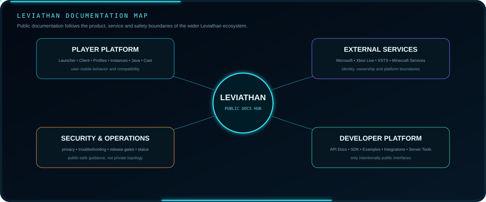
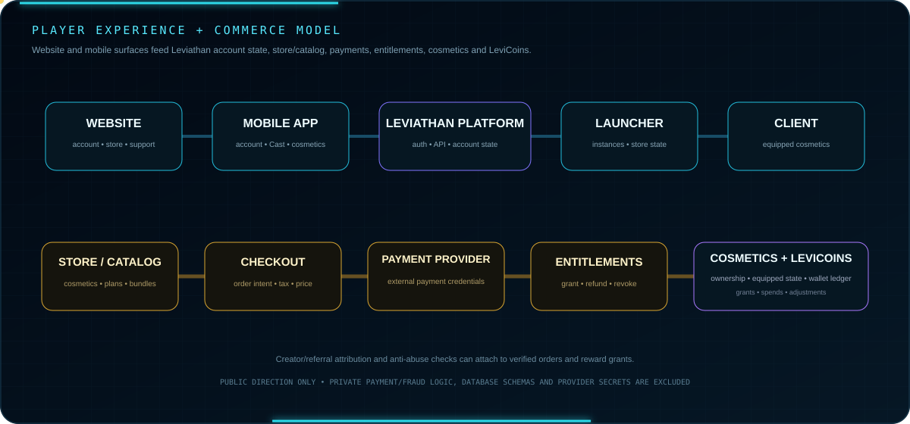

 

**The public documentation hub for the Leviathan ecosystem.**

[Guide](GUIDE.md) · [Security](SECURITY.md) · [Launcher](https://github.com/Lapinite/Leviathan-Launcher) · [API Docs](https://github.com/Lapinite/Leviathan-API-Docs) · [SDK](https://github.com/Lapinite/Leviathan-SDK)

## Documentation map

  

The documentation model follows four major boundaries: player software, external identity/platform services, developer interfaces, and security/operations. This keeps public documentation useful without publishing private implementation detail.

## Experience and commerce model

  

The planned public-facing experience spans the website, mobile app, launcher and client. Account and store state should remain consistent across those surfaces through Leviathan platform APIs and account mapping.

Commerce is intentionally separated from payment credentials. A purchase flow may move through catalog and checkout, an external payment provider, verified order state and then Leviathan entitlement state. Payment-card credentials should remain with the payment provider rather than being stored by Leviathan.

Cosmetics ownership, equipped state and LeviCoins are expected to be separate platform responsibilities. LeviCoins should use a ledger-style model for grants, spends and adjustments rather than a mutable balance with no history. Referral, creator and campaign rewards should attach to verified platform events and include anti-abuse controls.

## Start here

The [public guide](GUIDE.md) is the main topic-by-topic entry point. It currently covers:

- [Status terminology](GUIDE.md#status-terminology)
- [Launcher and Client](GUIDE.md#launcher-and-client)
- [Authentication](GUIDE.md#authentication)
- [Minecraft installation](GUIDE.md#minecraft-installation)
- [Instances and profiles](GUIDE.md#instances-and-profiles)
- [Java and runtime management](GUIDE.md#java-and-runtime-management)
- [Cast TV](GUIDE.md#cast-tv)
- [APIs and developer tooling](GUIDE.md#apis-and-developer-tooling)
- [Integrations](GUIDE.md#integrations)
- [Server tooling and Nimbus](GUIDE.md#server-tooling-and-nimbus)
- [Security and privacy](GUIDE.md#security-and-privacy)
- [Troubleshooting](GUIDE.md#troubleshooting)
- [Releases](GUIDE.md#releases)

## External service boundaries

Leviathan may interoperate with Microsoft account services, Xbox Live, XSTS, Minecraft Services, Mojang/Minecraft platform services, Discord, payment providers and other intentionally supported third-party systems. These services remain external trust and data boundaries with their own terms, availability requirements and security controls.

Public docs may explain the high-level flow from Microsoft authentication to Xbox/XSTS, Minecraft ownership/profile verification, Leviathan account mapping, launcher/client state, Cast/device state, supported public integrations and verified commerce events. Raw credentials, confidential tokens, private service topology, database schemas and internal endpoints remain outside public documentation.

## Data platform direction

At a high level, Leviathan data architecture is expected to separate relational product/account state, ephemeral cache/session state, object storage/backups and asynchronous event processing. Public documentation may describe responsibilities such as accounts, linked Minecraft identity, launcher/client state, website/mobile state, Cast sessions, licensing, orders, entitlements, cosmetics ownership, LeviCoins ledger events, referrals, telemetry, analytics, Nimbus/security metadata and audit history, but not private schemas or infrastructure addresses.

## Scope

This repository documents intentionally public-facing parts of Leviathan. Documentation may describe user-visible behavior, supported public interfaces, public configuration, compatibility, troubleshooting, security guidance, and release-facing concepts.

It should always distinguish between:

| Term | Meaning |
| --- | --- |
| **Available** | Publicly usable and intentionally documented |
| **In development** | Actively being built or validated, not necessarily available |
| **Planned** | Directional work that may change |
| **Private/internal** | Not intended for public implementation detail |

## Documentation safety

Public documentation must not contain credentials, tokens, private keys, signing material, recovery material, personal information, private endpoints, database credentials, payment-provider secrets, internal hostnames, sensitive infrastructure topology, or machine-specific local development paths.

High-level product architecture may be documented when it is intentionally sanitized and useful to users or developers. Sensitive implementation details remain private.

## Related public repositories

| Repository | Purpose |
| --- | --- |
| [Leviathan Launcher](https://github.com/Lapinite/Leviathan-Launcher) | Launcher project information, policies and roadmap |
| [Leviathan API Docs](https://github.com/Lapinite/Leviathan-API-Docs) | Public API contracts and integration reference |
| [Leviathan SDK](https://github.com/Lapinite/Leviathan-SDK) | Supported developer interfaces |
| [Leviathan Integrations](https://github.com/Lapinite/Leviathan-Integrations) | Public platform integration patterns |
| [Leviathan Examples](https://github.com/Lapinite/Leviathan-Examples) | Small safe implementation examples |
| [Leviathan Server Tools](https://github.com/Lapinite/Leviathan-Server-Tools) | Public Minecraft server-side tooling |
| [Leviathan Status](https://github.com/Lapinite/Leviathan-Status) | Public service status and incidents |

## Project status

Leviathan is under active development. Documentation evolves as interfaces, behavior, compatibility, and release plans stabilize. A documented development area does not imply that a public build or service is currently available.

## Minecraft and Microsoft notice

Leviathan is an independent third-party project. It is not affiliated with, sponsored by, endorsed by, operated by, or officially associated with Microsoft, Mojang Studios, Xbox, or Minecraft.

Third-party trademarks, services, libraries, payment providers and assets remain subject to their respective owners and licenses.

## Community

GitHub: https://github.com/Lapinite  
Discord: https://discord.gg/f75VJjPea
