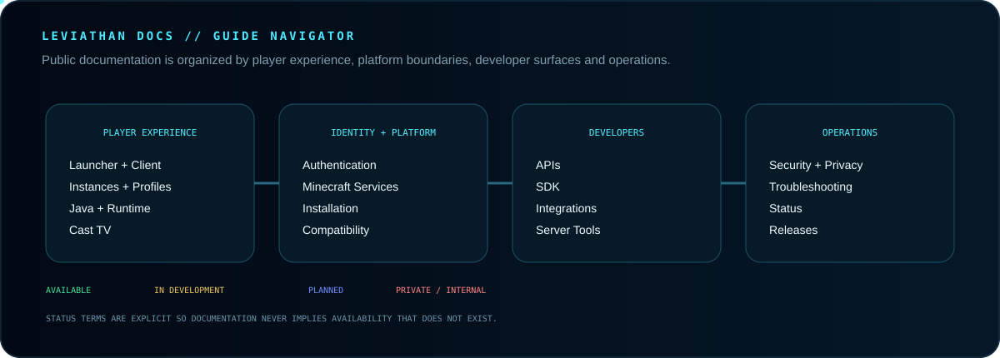

 

**The public documentation hub for the Leviathan ecosystem.**

[Guide](GUIDE.md) · [Security](SECURITY.md) · [Launcher](https://github.com/Lapinite/Leviathan-Launcher) · [API Docs](https://github.com/Lapinite/Leviathan-API-Docs) · [SDK](https://github.com/Lapinite/Leviathan-SDK)

## Documentation map

## Experience + commerce

## Guide navigator

<a href="GUIDE.md"><strong>Public Guide</strong></a> ·
<a href="GUIDE.md#authentication"><strong>Authentication</strong></a> ·
<a href="GUIDE.md#cast-tv"><strong>Cast TV</strong></a> ·
<a href="GUIDE.md#apis-and-developer-tooling"><strong>Developer Tooling</strong></a> ·
<a href="GUIDE.md#security-and-privacy"><strong>Security</strong></a> ·
<a href="GUIDE.md#troubleshooting"><strong>Troubleshooting</strong></a>

## Public boundary

Leviathan documentation may explain public-safe architecture, service boundaries and supported product behavior. Credentials, tokens, private endpoints, database schemas, payment secrets, internal hostnames and sensitive infrastructure topology stay private.

Microsoft, Xbox, Minecraft/Mojang, Discord, payment providers and other third-party services remain external systems with their own terms and security controls.

## Network

[Launcher](https://github.com/Lapinite/Leviathan-Launcher) · [API Docs](https://github.com/Lapinite/Leviathan-API-Docs) · [SDK](https://github.com/Lapinite/Leviathan-SDK) · [Integrations](https://github.com/Lapinite/Leviathan-Integrations) · [Examples](https://github.com/Lapinite/Leviathan-Examples) · [Server Tools](https://github.com/Lapinite/Leviathan-Server-Tools) · [Status](https://github.com/Lapinite/Leviathan-Status)

Leviathan is under active development. Documented areas may still be internal, planned or in validation and do not imply public availability.

Leviathan is an independent third-party project and is not affiliated with, sponsored by, endorsed by or operated by Microsoft, Mojang Studios, Xbox or Minecraft.

GitHub: https://github.com/Lapinite  
Discord: https://discord.gg/f75VJjPea
