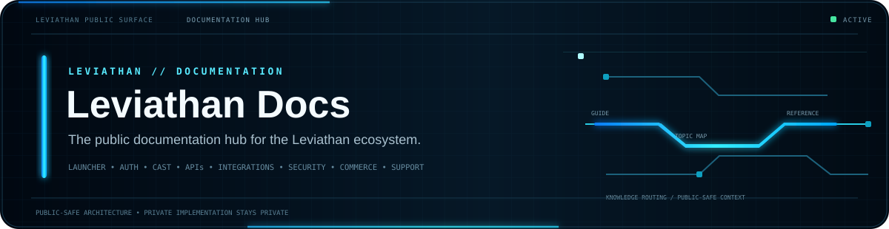

 

**The public documentation hub for the Leviathan ecosystem.**

[Guide](GUIDE.md) · [Security](SECURITY.md) · [Launcher](https://github.com/Lapinite/Leviathan-Launcher) · [API Docs](https://github.com/Lapinite/Leviathan-API-Docs) · [SDK](https://github.com/Lapinite/Leviathan-SDK)

## Documentation map

<table width="100%">
<tr>
<td width="33%" valign="top"><strong>Player Platform</strong> Launcher · Client · Minecraft installation · instances · profiles · Java/runtime management · Cast</td>
<td width="33%" valign="top"><strong>Developer Platform</strong> APIs · SDK · integrations · webhooks · examples · compatibility</td>
<td width="33%" valign="top"><strong>Operations & Safety</strong> Security · privacy · troubleshooting · releases · support · status terminology</td>
</tr>
</table>

## Start here

The [public guide](GUIDE.md) is the main topic-by-topic entry point. It currently covers:

- [Status terminology](GUIDE.md#status-terminology)
- [Launcher and Client](GUIDE.md#launcher-and-client)
- [Authentication](GUIDE.md#authentication)
- [Minecraft installation](GUIDE.md#minecraft-installation)
- [Instances and profiles](GUIDE.md#instances-and-profiles)
- [Java and runtime management](GUIDE.md#java-and-runtime-management)
- [Cast TV](GUIDE.md#cast-tv)
- [APIs and developer tooling](GUIDE.md#apis-and-developer-tooling)
- [Integrations](GUIDE.md#integrations)
- [Server tooling and Nimbus](GUIDE.md#server-tooling-and-nimbus)
- [Security and privacy](GUIDE.md#security-and-privacy)
- [Troubleshooting](GUIDE.md#troubleshooting)
- [Releases](GUIDE.md#releases)

## Scope

This repository documents intentionally public-facing parts of Leviathan. Documentation may describe user-visible behavior, supported public interfaces, public configuration, compatibility, troubleshooting, security guidance, and release-facing concepts.

It should always distinguish between:

| Term | Meaning |
| --- | --- |
| **Available** | Publicly usable and intentionally documented |
| **In development** | Actively being built or validated, not necessarily available |
| **Planned** | Directional work that may change |
| **Private/internal** | Not intended for public implementation detail |

## Documentation safety

Public documentation must not contain credentials, tokens, private keys, signing material, recovery material, personal information, private endpoints, database credentials, internal hostnames, sensitive infrastructure topology, or machine-specific local development paths.

High-level product architecture may be documented when it is intentionally sanitized and useful to users or developers. Sensitive implementation details remain private.

## Related public repositories

| Repository | Purpose |
| --- | --- |
| [Leviathan Launcher](https://github.com/Lapinite/Leviathan-Launcher) | Launcher project information, policies and roadmap |
| [Leviathan API Docs](https://github.com/Lapinite/Leviathan-API-Docs) | Public API contracts and integration reference |
| [Leviathan SDK](https://github.com/Lapinite/Leviathan-SDK) | Supported developer interfaces |
| [Leviathan Integrations](https://github.com/Lapinite/Leviathan-Integrations) | Public platform integration patterns |
| [Leviathan Examples](https://github.com/Lapinite/Leviathan-Examples) | Small safe implementation examples |
| [Leviathan Server Tools](https://github.com/Lapinite/Leviathan-Server-Tools) | Public Minecraft server-side tooling |
| [Leviathan Status](https://github.com/Lapinite/Leviathan-Status) | Public service status and incidents |

## Project status

Leviathan is under active development. Documentation evolves as interfaces, behavior, compatibility, and release plans stabilize. A documented development area does not imply that a public build or service is currently available.

## Minecraft and Microsoft notice

Leviathan is an independent third-party project. It is not affiliated with, sponsored by, endorsed by, operated by, or officially associated with Microsoft, Mojang Studios, Xbox, or Minecraft.

Third-party trademarks, services, libraries, and assets remain subject to their respective owners and licenses.

## Community

GitHub: https://github.com/Lapinite  
Discord: https://discord.gg/f75VJjPea
